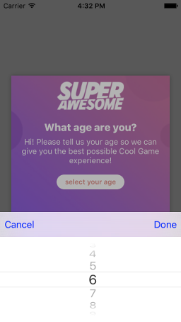

Trigger the Age Gate
====================

In order to easily separate and direct users to different parts of your app based on their age, the Age Gate SDK has two simple methods:
One will add a callback that will notify you of the age the user has selected and one will actually trigger the Age Gate UI.

To set a callback:

.. code-block:: objective-c

    #import "SAAgeGate.h"

    - (BOOL)application:(UIApplication* )application
      didFinishLaunchingWithOptions:(NSDictionary*) launchOptions {

      //
      // add a callback to the Age Gate
      [[SAAgeGate getInstance] setCallback:^(NSInteger age) {
        // separate users
      }];

      return YES;
    }

To trigger the age gate:

.. code-block:: objective-c

    #import "SAAgeGate.h"

    - (BOOL)application:(UIApplication* )application
      didFinishLaunchingWithOptions:(NSDictionary*) launchOptions {

      //
      // ...

      //
      // Start the Age Gate UI
      [SAAgeGate play];

      return YES;
    }

Additionally you can override the display name that's shown on the Age Gate:

.. code-block:: objective-c

    #import "SAAgeGate.h"

    - (BOOL)application:(UIApplication* )application
      didFinishLaunchingWithOptions:(NSDictionary*) launchOptions {

      //
      // Override Age Gate display name
      [SAAgeGate overrideName: @"__MY_APP_NAME__"];

      //
      // override Age Gate logo
      [SAAgeGate overrideLogo: [UIImage imageName: @"__MY_APP_LOGO__"]];

      return YES;
    }

Finally, you should see something similar to the following images:

.. warning:: It's recommended to trigger the Age Gate as soon as your app starts, for example, in the App Delegate.

.. note:: You can also find out the current stored user's age by asking **[SAAgeGate getCurrentAge];**
